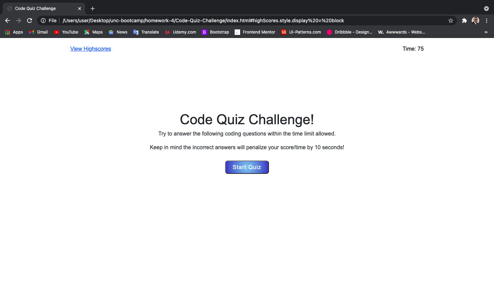
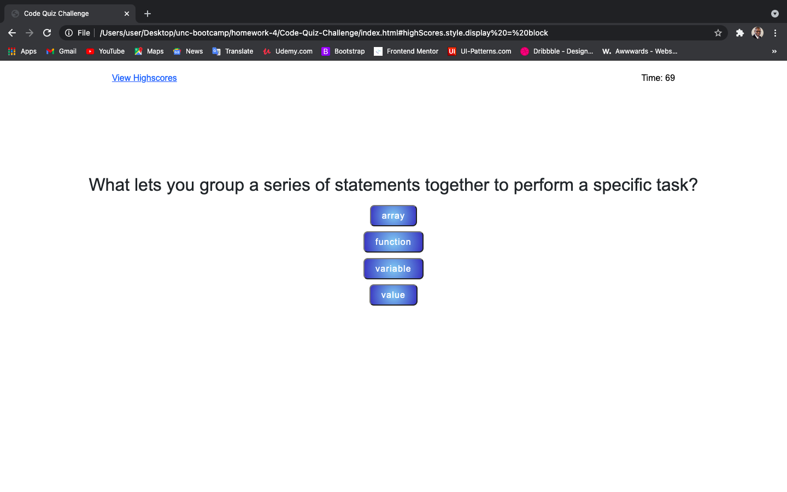
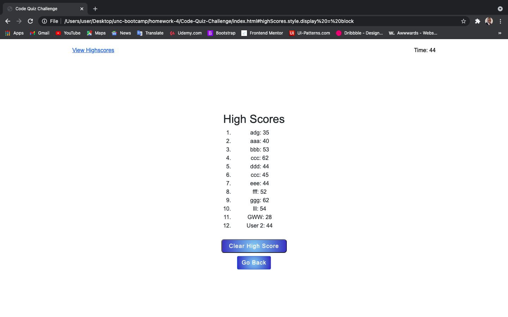

# Code-Quiz-Challenge

---

*  The purpose of this repository is to create a DOM application that allows the user to answer a series of questions, be able to enter in their initials, and receive their score at the end.

* This app will be a timed coding quiz with multiple-choice questions.

* This app will dynamically run in the browser using HTML, CSS, & JavaScript.

* Given the user is asked a series of questions, given 4 choices, and at the end, given the opportunity to enter in their initials and given their socre.

* The last page will be a list of the users and their score.

## Screen Shots

* This is the first page that will render in the browser.

* This is an example of the question page.

* This is an example of the High Scores page, with a list of users and their score.

---

* Gitub Repo Link: [Github.com](https://github.com/sawhite110/Code-Quiz-Challenge)